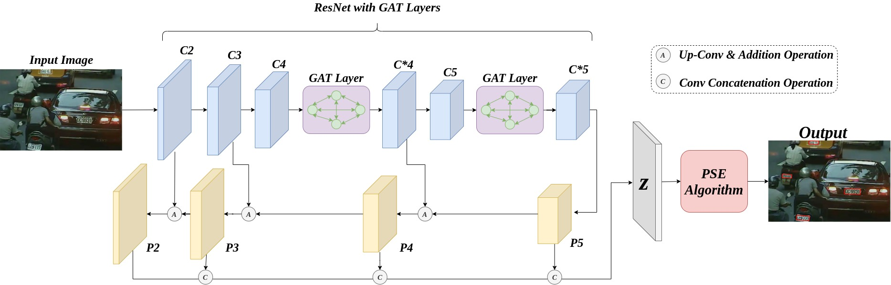

# Graph Attention Network for Detecting License Plates in Crowded Street Scenes

**Pinaki Nath Chowdhury**, Palaiahnakote Shivakumara, Ramachandra Raghavendra, Umapada Pal, Tong Lu, Daniel Lopresti

## Abstract

Detecting license plate numbersin crowded street scenes is challenging and requires the attention of researchers. In contrast to existing methods that focus on imagesthat are not crowded with vehicles, in this workwe aim at situations that are common, for example, in city environmentswhere numerous with different types like cars, trucks, motorbike etc.are present in complex, busy environments. In such cases, one can expect large variations in license plates, backgrounds, and various forms of occlusion. To address these challenges, we explore Adaptive Progressive Scale Expansion based Graph Attention Network (APSEGAT). This approach extracts local information which represent license plate irrespective of vehicle types and numbers because it works at the pixel level in a progressive way, and identifies the dominant information in the image. This may include other parts of vehicles, drivers and pedestrians, and various other backgroundobjects. To overcome this problem, we integrate concepts from graph attention networks with progressive scale expansion networks. For evaluating the proposed method, we use our own dataset, named as ISI-AMLPR, which contains images captured in different crowded street scenes in different time span, and the benchmark dataset namely, UFPR-ALPR,which provides images of a single vehicle, and another benchmark dataset called, UCSD, which contains images of cars with different orientation.Experimental results on these datasets show that the proposed method outperforms existing methods and is effective in detecting license plate numbers in crowded street scenes.

### Network Architecture


### Sample Results


### Installation Instructions
Please use miniconda / Anaconda for ease of installation

- ```git clone```

- ```conda env create -f environment.yml```

- ```pip install Polygon3```

- Download trained model on youtube dataset from [Google Drive](https://drive.google.com/file/d/1xngclFs5ZO3vffklbho-ZlCzaHdBrw8F/view?usp=sharing)

- Save the model weights inside ```output/``` directory

### Test Installation
run ```python eval.py```

If you see detection result in the ```results/``` directory, it means you have successfully setup this system

### Training on Custom Dataset
- Follow icdar15 dataset format
```
trainset\testset
|
|_  img
|   |_ 1.jpg
|   |_ 2.jpg
|   |
|
|_  gt
|   |_ gt_1.txt
|   |_ gt_2.txt
|   |
```

- Change Line 5 and 6 in ```config.py``` and specify path of training and test set
- Run ```python train.py```. You should see INFO about training. Check ```output``` directory for logs

### Reference
A huge thanks to [WenmuZhou](https://github.com/WenmuZhou/PSENet.pytorch) !! I built my idea on top of their implementation of PSENet.

### Future Task
- Clean code
- Upload URL to the Full Paper

### Application to download the novel ISI-AMLPR dataset
Please send an email to me ```contact [at] pinakinathc.me``` **and** Prof. Dr. Umapada Pal ```umapada [at] isical.ac.in```
